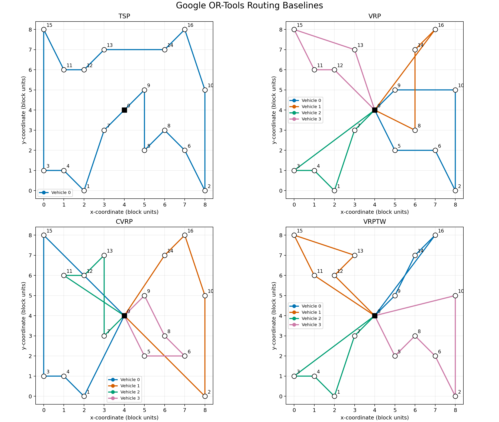

# Week 1 Research Progress: Classical Routing Baselines

**Reporting date:** 12 June 2026

**Project:** Deep Reinforcement Learning for the Electric Vehicle Routing
Problem with Time Windows (EVRP-TW)

## 1. Research objectives

The first week established the conceptual and computational foundations for
subsequent EVRP-TW research. The work focused on understanding the hierarchy
of classical routing problems, configuring the required software environment,
and reproducing four Google OR-Tools baselines: TSP, VRP, CVRP, and VRPTW.
These baselines provide interpretable reference solutions against which future
learning-based methods can be evaluated.

## 2. Core concepts acquired

The routing problems form a sequence of increasingly constrained optimisation
models:

| Problem | Decision structure | Principal constraints | Baseline objective |
|---|---|---|---|
| TSP | One vehicle visits every customer once and returns to the depot | Single closed tour | Minimise total distance |
| VRP | Multiple vehicles jointly serve all customers | Depot departure and return; each customer served once | Minimise total distance while penalising the longest route |
| CVRP | VRP with customer demand | Vehicle load must not exceed capacity | Minimise total distance subject to capacity feasibility |
| VRPTW | VRP with allowable service intervals | Arrival must fall within each customer's time window; waiting is permitted | Minimise total travel time subject to temporal feasibility |

This progression clarifies the role of state variables and feasibility masks
in the target EVRP-TW model. EVRP-TW extends CVRP and VRPTW by introducing
battery state, energy consumption, and charging decisions. Consequently, a
learning-based policy must optimise route quality without violating capacity,
time-window, battery, fleet, and charging constraints.

## 3. Environment and reproducibility

The research environment was configured and validated with:

- Operating system: macOS 15.6, build 24G84;
- Hardware: Apple M4, arm64;
- Python 3.13.12;
- Package manager: `pip 26.0.1` from the Miniconda Python environment;
- Google OR-Tools 9.15.6755;
- Matplotlib 3.10.9;
- Git and a reproducible repository structure for code, results, and logs.

The exact dependency installation command is:

```bash
cd src/experiments/week1
python -m pip install -r requirements.txt
```

The baseline implementation is located in
`src/experiments/week1/`. Each studied algorithm is stored as a separate
Python file, and `compare_or_tools_baselines.py` reproduces all solver
outputs, route tables, and route visualisations:

```bash
cd src/experiments/week1
python compare_or_tools_baselines.py
```

The runtime was measured with:

```bash
cd src/experiments/week1
/usr/bin/time -p python compare_or_tools_baselines.py
```

Measured output:

```text
TSP: objective=4384, routes=1
VRP: objective=177500, routes=4
CVRP: objective=6872, routes=4
VRPTW: objective=74, routes=4
real 1.21
user 0.80
sys 0.09
```

## 4. Baseline methodology

All experiments use the official 17-node demonstration data from the Google
OR-Tools routing guides. Node 0 is the depot. The `PATH_CHEAPEST_ARC`
first-solution strategy is used consistently to provide a deterministic and
transparent baseline.

The VRP includes a distance dimension and a global span cost coefficient of
100. Its reported solver objective is therefore a composite quantity:

```text
total route distance + 100 x maximum route distance
```

The CVRP uses four vehicles with capacity 15. The VRPTW permits waiting time
and restricts each customer to its specified service interval.

## 5. Experimental results

The smoke test instance size is 17 nodes for each classical routing example.
All four baseline runs returned solver solutions, so the feasibility status is
recorded as feasible.  The measured runtime for the complete four-baseline
smoke run was 1.21 seconds.

| Problem | Instance size | Solver objective | Feasibility status | Runtime record | Additional metric | Vehicles used |
|---|---:|---:|---|---:|---:|---:|
| TSP | 17 nodes | 4,384 | Feasible | Included in 1.21 s total run | Total distance: 4,384 m | 1 |
| VRP | 17 nodes | 177,500 | Feasible | Included in 1.21 s total run | Total distance: 6,300 m; maximum route: 1,712 m | 4 |
| CVRP | 17 nodes | 6,872 | Feasible | Included in 1.21 s total run | Total distance: 6,872 m; load: 15 per route | 4 |
| VRPTW | 17 nodes | 74 | Feasible | Included in 1.21 s total run | Total travel time: 74 time units | 4 |

The exact numerical outputs and node sequences are retained in
[`route_tables.md`](../src/experiments/week1/results/route_tables.md).
The combined route visualisation is shown below.



## 6. Interpretation

The TSP baseline demonstrates pure route ordering without resource
constraints. The VRP divides the customer set among vehicles and illustrates
the distinction between minimising aggregate distance and balancing the
longest route. The CVRP shows that geometrically attractive assignments may be
infeasible when accumulated demand exceeds vehicle capacity. The VRPTW
further demonstrates that waiting and service schedules are part of route
feasibility, so a short spatial route is not necessarily a valid temporal
route.

These observations directly inform the EVRP-TW research design. Future
reinforcement-learning experiments should report feasibility separately from
objective value and should compare only feasible solutions. Evaluation must
include at least route cost, feasibility rate, vehicles used, runtime, and
constraint-specific violations.

## 7. Week 1 checkpoint

### Team info

- Team name: FURP-2026-Chenyu-Fan-Deep-RL-EVRP-TW
- Members: Chenyu Fan
- Date: 12 June 2026

### Environment

- [x] Environment created
- [x] Dependencies installed
- [x] Repo structure understood

### Baseline run

- [x] Baseline command executed
- [x] Objective value reported
- [x] Feasibility status reported
- [x] Runtime reported
- [x] Evidence attached as route text and route plot

### Reflection checkpoint

1. Main setup issue: selecting a baseline scope that was small enough for Week
   1 while still relevant to EVRP-TW.
2. How it was solved: the OR-Tools VRPTW path was selected, then extended with
   TSP, VRP, and CVRP smoke tests to clarify the constraint hierarchy.
3. Current risk for Week 2: the Week 1 OR-Tools examples do not include
   electric-vehicle battery or charging-station constraints, so Week 2 needs
   explicit E-constraint implementation or repair logic.

## 8. Required Week 1 reflection

The easiest constraint to understand was the capacity constraint in CVRP,
because each route has a simple accumulated load that must stay below the
vehicle capacity.  The most confusing output was the VRP objective value,
because OR-Tools reported a composite objective that included both total
distance and a global span penalty for the longest route.  The Week 2 baseline
target is to compare POMO-style construction, GA, and OR-based methods while
adding electric-vehicle battery and time-window feasibility checks.

## 9. Week 1 outcome and next stage

Week 1 achieved the following milestones:

- understood the core mathematical relationships among TSP, VRP, CVRP,
  VRPTW, and EVRP-TW;
- completed the software and repository environment required for the project;
- reproduced all four classical OR-Tools baselines;
- generated auditable route tables, machine-readable results, and route maps;
- established a classical optimisation reference for later Deep RL
  evaluation.

The next stage is to formalise the EVRP-TW experimental protocol, confirm the
paper and benchmark datasets to be replicated, and compare the existing
greedy, REINFORCE, and PPO implementations against stronger optimisation
baselines under fixed seeds and common instances.

## References

1. Google. *OR-Tools: Vehicle Routing*.
   https://developers.google.com/optimization/routing
2. Google. *Travelling Salesperson Problem*.
   https://developers.google.com/optimization/routing/tsp
3. Google. *Vehicle Routing Problem*.
   https://developers.google.com/optimization/routing/vrp
4. Google. *Capacity Constraints*.
   https://developers.google.com/optimization/routing/cvrp
5. Google. *Vehicle Routing Problem with Time Windows*.
   https://developers.google.com/optimization/routing/vrptw
