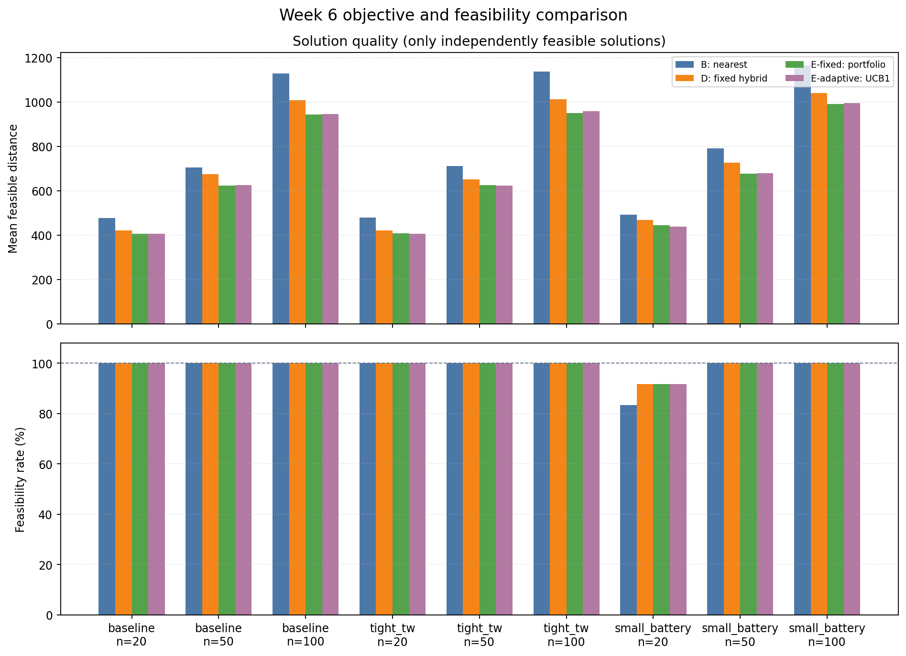
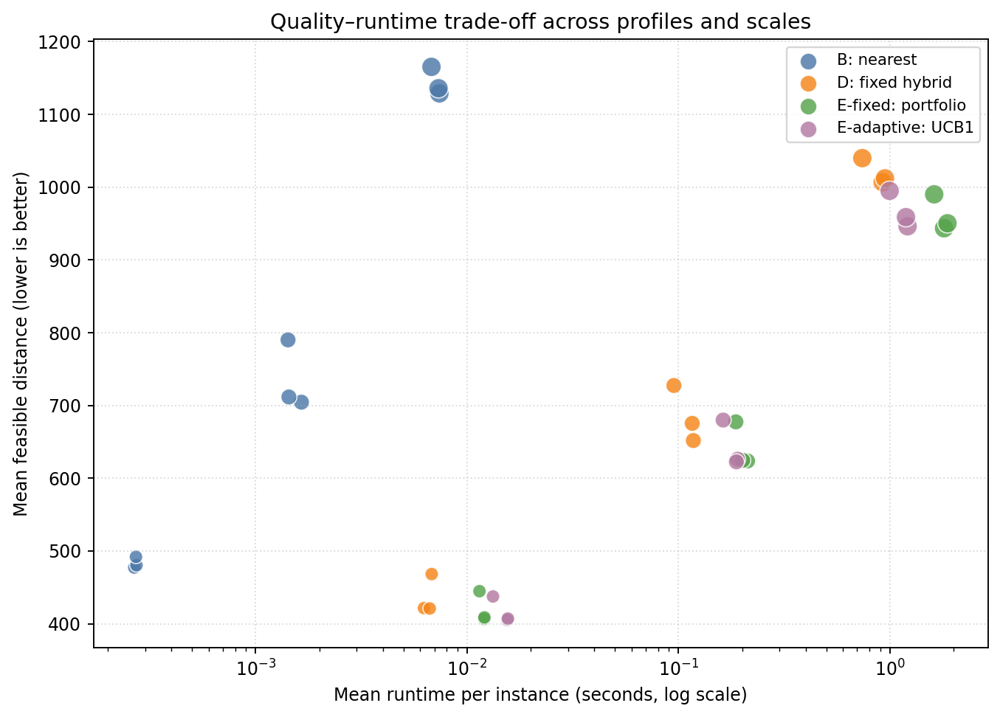
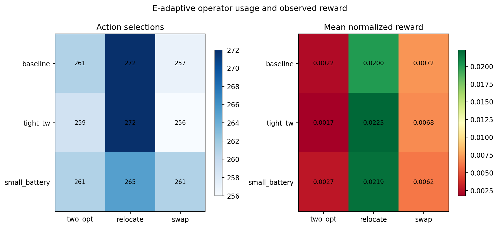
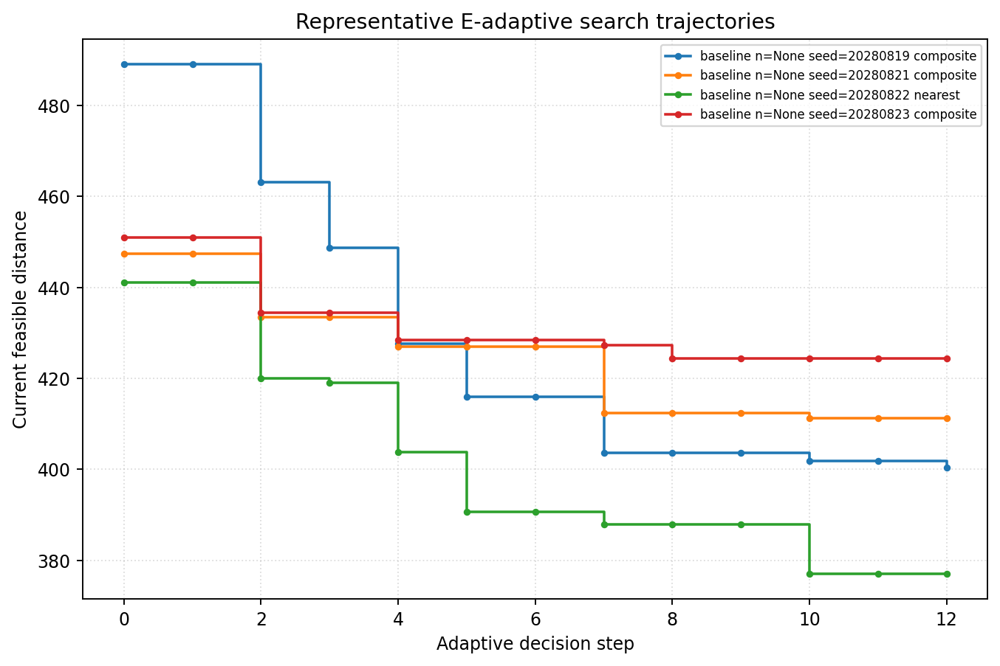
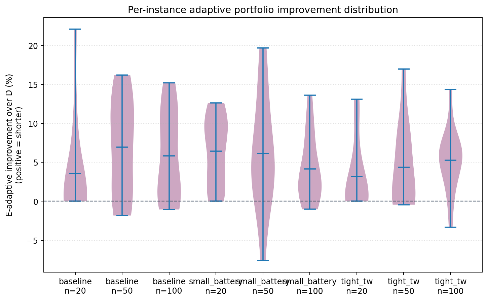

# Week 6 Integration Note: Portfolio Search and Adaptive Operator Selection

**Project:** Deep RL for Electric Vehicle Routing with Time Windows (EVRP-TW)

**Student:** Chenyu Fan

**Supervisor:** Tianxiang Cui

## 1. Current Stage

This week primarily follows **Track B: combine existing methods**. Weeks 3–5
already provide two deterministic construction rules, an independent EVRP-TW
validator, feasibility-aware 2-opt, and inter-route relocate/swap operators.
The project is therefore ready to integrate them rather than start another
isolated method.

It also follows a limited **Track C** extension: deterministic UCB1 chooses
local-search operators and generates action traces. This is not presented as a
complete reinforcement-learning model. It is a transparent baseline used to
test whether operator effectiveness varies enough to justify learning a
state-dependent policy later.

## 2. Method Design


```text
instance
  -> nearest construction + composite construction
  -> independent feasibility and coverage check
  -> 2-opt warm start
  -> fixed relocate/swap OR UCB1-selected 2-opt/relocate/swap
  -> independent validation after every accepted state
  -> shortest feasible candidate
  -> result table and action trace
```

Four controlled methods are compared:

| ID | Method | Purpose |
|---|---|---|
| B | nearest construction | simple baseline |
| D | composite + 2-opt + fixed inter-route search | Week 5 reference |
| E-fixed | two-constructor portfolio + exhaustive fixed search | isolates portfolio value |
| E-adaptive | same portfolio + UCB1-selected bounded actions | tests adaptive selection |

UCB1 first explores 2-opt, relocate, and swap, then selects the action with the
largest mean normalized reward plus an exploration bonus. The reward is
`(distance_before - distance_after) / distance_before`. Infeasible transitions
receive -1 and are rejected. Search stops after 12 actions or four consecutive
non-improving actions.

## 3. Experiment Plan and Completed Matrix

The experiment answers all Lab 6 planning questions:

- **Baselines:** B and D; E-fixed is the ablation for E-adaptive.
- **Instances:** synthetic EVRP-TW instances with 20, 50, or 100 customers;
  baseline, tight-time-window, and small-battery profiles.
- **Replicates:** 12 fixed seeds per profile/scale cell.
- **Metrics:** feasibility, violations, mean/median/best feasible distance,
  runtime, vehicles, initial-solution improvement, actions, accepted moves,
  reward, and wins/ties/losses.
- **Improvement criterion:** feasibility must not fall below the reference and
  mean feasible distance must fall; runtime cost remains visible.
- **Expected failures:** construction-stage coverage failure, expensive n=100
  inter-route search, and adaptive exploration that does not always beat a
  full fixed schedule.

The completed matrix contains **108 instances per method and 432 runs total**,
which exceeds the Lab 6 suggested minimum. The action dataset contains **2,364
trace rows**.

## 4. Results and Inspectable Evidence



E-adaptive improves mean feasible distance over D in every cell without a
feasibility-rate loss:

| Profile | n=20 | n=50 | n=100 |
|---|---:|---:|---:|
| baseline | -3.85% | -7.29% | -6.01% |
| tight TW | -3.30% | -4.49% | -5.27% |
| small battery | -6.57% | -6.53% | -4.32% |

Negative values mean shorter routes. On jointly feasible instances,
E-adaptive records 83 wins, 15 ties, and 9 losses against D across all cells.
The losses matter: adaptive selection improves the aggregate but is not
universally best on every instance.

E-fixed improves over D by 2.92%–7.65% and records no per-instance losses. This
shows that the two-constructor portfolio is the main quality improvement.
E-adaptive instead offers a compute trade-off: at n=100 its runtime is about
62%–67% of E-fixed, but its mean distance is 0.29%–0.89% worse in three n=100
cells. Across all nine cells, E-adaptive beats E-fixed mean distance in four and
trails it in five.



Feasible totals are B 106/108, D 107/108, E-fixed 107/108, and E-adaptive
107/108. The portfolio improves route quality, but it does not add a
construction repair: when both constructors fail, local search cannot invent a
missing feasible route.

### Adaptive evidence



| Action | Selections | Accepted | Mean normalized reward |
|---|---:|---:|---:|
| 2-opt | 781 | 234 | 0.0022 |
| relocate | 809 | 712 | 0.0214 |
| swap | 774 | 407 | 0.0067 |

Relocate is most productive on average. However, UCB1 is state-free, so it
cannot learn that a different action may work better for a particular instance
or search stage. The complete MDP in `docs/week6_mdp_design.md` defines the
state-dependent extension.





All data are inspectable in `src/experiments/week6/results/`. The reproducibility
check repeats 108 method-instance cases three times and reports **108 passes,
zero mismatches**.

## 5. Problems and Limitations

- Synthetic instances support controlled internal comparison but not published
  Schneider-benchmark comparison.
- E-fixed duplicates expensive search across two candidates; n=100 runtime is
  the main cost.
- UCB1 uses global action history within one episode but no state features. It
  is adaptive operator allocation, not full RL.
- E-adaptive's exploration causes occasional losses against D and a small mean
  quality gap against E-fixed in five cells.
- The remaining infeasible portfolio instance needs construction/station repair;
  post-construction local search is not the correct repair stage.

## 6. Conclusion and Next Step

Week 6 establishes a coherent final-project direction: a validated portfolio
is a stronger baseline than a single construction pipeline, and adaptive
selection can reduce the cost of exhaustive search while retaining most of its
quality. The evidence supports collecting state-dependent traces, but not yet
claiming that RL is necessary.

Next, add construction-stage station insertion/repair, evaluate on Schneider
EVRP-TW instances, and train a small contextual policy only if held-out traces
show predictable differences in action value beyond the fixed and UCB1 rules.

## Reproduce

```bash
python3 -m unittest discover -s src/experiments/week6/tests -v
python3 src/experiments/week6/compare_week6_methods.py --scales 20 50 100 --profiles baseline tight_tw small_battery --instances-per-scale 12 --seed 20260813 --adaptive-steps 12 --patience 4
python3 src/experiments/week6/reproducibility_check.py --scales 20 50 100 --instances-per-scale 3 --repeats 3 --profiles baseline tight_tw small_battery --seed 20260813
python3 src/experiments/week6/visualize_week6.py
```
