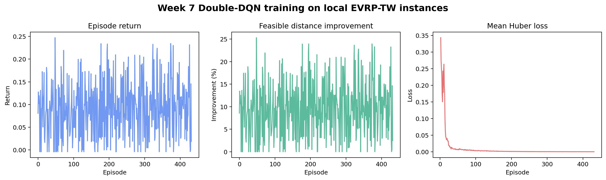

# Week 7 Research Extension: Double-DQN Operator Selection

## 1. Position in the project

This work is a self-directed extension beyond the minimum Week 6 learning
prototype.  Week 6 established a strong two-source portfolio, deterministic
UCB1 action selection, an independent EVRP-TW validator, and a complete MDP
design.  Week 7 implements the missing learning loop and evaluates it without
changing the underlying routing operators.

The scientific question is intentionally narrow: can a small learned policy
choose among the existing 2-opt, relocate, and swap operators better than a
fixed schedule or UCB1?  This is hybrid RL for local-search control, not an
end-to-end neural route constructor.

## 2. Complete MDP and learner

The 12-value state includes instance scale, fleet use, objective ratio,
cumulative improvement, search progress, stagnation, previous reward,
acceptance rate, last-action one-hot values, and construction source.  Actions
are 2-opt, relocate, and swap.  A transition applies one real deterministic
operator pass and accepts only a strictly shorter independently feasible route.

Accepted reward is normalized improvement relative to the episode warm start;
a feasible non-improvement receives `-0.001`, and an infeasible candidate
receives `-1.0`.  Episodes terminate after 12 decisions or four consecutive
non-improvements.

The Double DQN uses a 12→32→3 NumPy MLP, replay buffer, epsilon decay, Huber
loss, Adam, gradient clipping, and a periodically synchronized target network.
The online network selects the next action; the target network evaluates it.
All model arrays and action order are validated when loading the NPZ
checkpoint.

## 3. Fair experiment design

Training and evaluation use the same deterministic generator but disjoint seed
sets.  Training covers three profiles, scales 20/50/100, eight seeds per cell,
two construction sources, and three epochs.  Held-out evaluation uses six
different seeds per cell and compares:

- Week 5 `D_composite_inter_route`;
- Week 6 `E_fixed_portfolio`;
- Week 6 `E_adaptive_portfolio` (UCB1);
- Week 7 `F_dqn_portfolio` (Double DQN).

All methods share instance data, feasibility rules, local-search operators, and
the 12-step/4-patience search budget.  Objective averages use feasible routes
only.  Feasibility and runtime use all attempted rows.

## 4. Local execution evidence

The run at `2026-08-13 18:22:10 CST` generated:

- 432 training episodes;
- 4,388 replay transitions and 4,357 optimizer updates;
- 54 unseen instances and 216 held-out method runs;
- 1,012 held-out DQN action transitions;
- zero train/evaluation seed overlap;
- zero independent validation mismatches;
- 92.54 seconds training time and 206.59 seconds end-to-end time.

The committed checkpoint hash is
`8b5b85cad33a3b91aed76441ebbb1dbee7a1ca73c49272f858d0be0a1f2d0de9`.

## 5. Results

### DQN versus Week 5 D

DQN improves mean feasible distance in all nine profile-scale cells, by 1.62%
to 8.20%, with no feasibility-rate change.  This confirms that the two-source
portfolio plus learned local-search control is stronger than the earlier
single-source fixed method on this held-out set.

### DQN versus Week 6 UCB1

| Profile | n | Objective delta DQN-UCB1 (%) | Runtime delta (s) | W/T/L |
|---|---:|---:|---:|---:|
| baseline | 20 | -0.55 | -0.000 | 2/3/1 |
| baseline | 50 | +0.70 | +0.014 | 1/3/2 |
| baseline | 100 | +3.65 | -0.143 | 0/0/6 |
| tight TW | 20 | -0.21 | +0.000 | 2/3/1 |
| tight TW | 50 | -1.01 | +0.032 | 2/4/0 |
| tight TW | 100 | -0.16 | +0.092 | 3/0/3 |
| small battery | 20 | 0.00 | +0.003 | 0/5/0 |
| small battery | 50 | +0.43 | +0.033 | 1/4/1 |
| small battery | 100 | -0.95 | +0.050 | 4/1/1 |

Negative objective delta means DQN is shorter.  DQN wins five aggregate cells,
ties one, and loses three.  It therefore offers evidence that context can help,
but not that a small MLP is universally better than UCB1.

### Learned action behavior

| Action | Selected | Accepted | Acceptance rate |
|---|---:|---:|---:|
| 2-opt | 199 | 63 | 31.7% |
| relocate | 484 | 347 | 71.7% |
| swap | 329 | 146 | 44.4% |

The policy strongly favors relocate, consistent with Week 6 traces where
relocate had the highest mean reward.  It still uses all three operators and
changes actions across states.

## 6. Failure and limitation cases

1. **Shared construction failure:** small-battery n=20 seed `20300014` leaves
   customers 8 and 18 unserved for D and makes both portfolio warm starts
   infeasible.  DQN cannot repair a state it never enters.  Every method solves
   53/54 held-out instances.
2. **Baseline n=100 generalization failure:** DQN is 3.65% worse than UCB1 on
   mean distance and loses all six paired instances.  Seed `20380016` is 85.36
   distance units worse than UCB1.  The 12-value aggregate state is insufficient
   to represent detailed route geometry at this scale.
3. **Quality/runtime ambiguity:** DQN is faster than UCB1 at baseline n=100 but
   slower in most tight-window and small-battery cells.  Learned selection does
   not eliminate the quadratic cost of relocate/swap passes.
4. **Synthetic-only evidence:** train and test seeds are separated, but both
   come from the same generator.  This is not evidence of transfer to Schneider
   benchmark distributions.
5. **Small network:** the MLP observes global search summaries rather than node
   or route embeddings.  It is a complete RL control prototype, not an
   attention/graph policy comparable to POMO or RL4CO.

## 7. Reproducibility

The dedicated check trains and evaluates the deterministic small matrix twice.
Both the model-parameter hash and the route/objective/action signature match,
giving two checks and zero mismatches.  Runtime and timestamps are excluded
because they are not deterministic scientific outputs.

Commands, raw JSON, flat CSV tables, model checkpoint, manifest, run log,
diagnostics, and every generated figure are committed under
`src/experiments/week7/results/`.

## 8. Conclusion and next experiment

The Week 7 prototype closes the loop from MDP design to training, checkpointing,
held-out evaluation, reproducibility, and honest negative-result analysis.
The most useful next experiment is not simply a larger MLP.  It is a
construction repair for infeasible warm starts plus a route-aware encoder (for
example pooled route features or a small graph encoder), evaluated on standard
Schneider EVRP-TW instances with the same D/E-fixed/UCB1 ablations.
