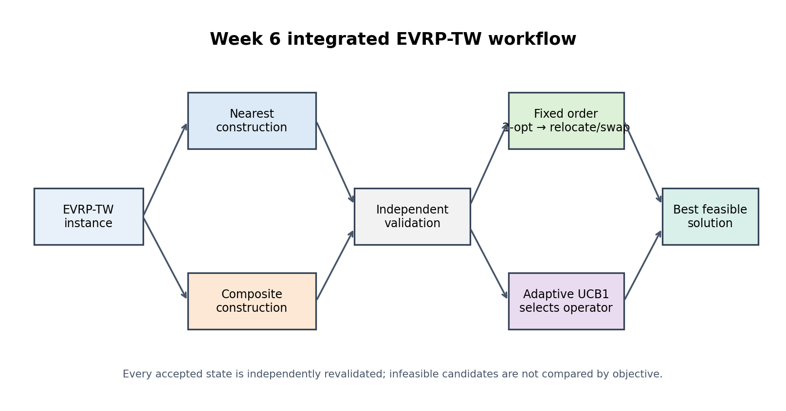

# Week 6: Integrated Portfolio and Adaptive Operator Selection

Week 6 follows **Track B** as the main path and **Track C** as a lightweight
extension. It combines the previously isolated EVRP-TW constructors and local
search operators into one validated workflow, then tests whether deterministic
UCB1 action selection offers a useful quality/runtime trade-off.

## Research question

> Does a nearest/composite construction portfolio improve on the Week 5 fixed
> Method D, and can UCB1 operator selection retain most of the portfolio benefit
> while avoiding the cost of exhaustively running every operator?

## Methods

- **B:** nearest-customer construction.
- **D:** composite construction + 2-opt + fixed relocate/swap (Week 5).
- **E-fixed:** run nearest and composite candidates through the fixed search,
  then retain the shortest independently feasible solution.
- **E-adaptive:** warm-start both candidates with 2-opt, then use deterministic
  UCB1 to choose bounded 2-opt, relocate, or swap actions.

Every final solution and accepted adaptive state is checked independently for
route anchoring, fleet size, exact customer coverage, duplicates, capacity,
time windows, battery use, charging, and depot return.



## Files

- `adaptive_selector.py` — generic normalized reward, deterministic UCB1, trace
  records, and bounded adaptive loop.
- `portfolio_solver.py` — Week 3–5 adapters, independent validator, and four
  comparison methods.
- `compare_week6_methods.py` — full experiment, aggregation, JSON/CSV/Markdown
  output, and learning-ready action traces.
- `reproducibility_check.py` — fixed-seed route/objective/action verification.
- `visualize_week6.py` — six generated research figures.
- `tests/` — 23 unit, integration, schema, reproducibility, and figure tests.
- `results/` — committed output generated by the commands below.

## Reproduce

```bash
python3 -m unittest discover -s src/experiments/week6/tests -v

python3 src/experiments/week6/compare_week6_methods.py \
  --scales 20 50 100 \
  --profiles baseline tight_tw small_battery \
  --instances-per-scale 12 --seed 20260813 \
  --adaptive-steps 12 --patience 4

python3 src/experiments/week6/reproducibility_check.py \
  --scales 20 50 100 --instances-per-scale 3 --repeats 3 \
  --profiles baseline tight_tw small_battery --seed 20260813

python3 src/experiments/week6/visualize_week6.py
```

## Actual experiment

The committed run contains 3 profiles × 3 scales × 12 seeds × 4 methods =
**432 method-instance runs** and **2,364 adaptive action records**.

- E-adaptive is shorter than D on mean feasible distance in all nine cells by
  **3.30%–7.29%**, with no feasibility-rate loss against D.
- E-fixed is shorter than D in all nine cells by **2.92%–7.65%** and has no
  per-instance losses against D on jointly feasible cases.
- E-adaptive is not always shorter than E-fixed: it wins on mean distance in
  four of nine cells and trails by 0.29%–0.89% in the other five. Its advantage
  is lower search cost at larger scales: its mean runtime is about 62%–67% of
  E-fixed at n=100.
- Relocate has the highest observed mean normalized reward (0.0214), ahead of
  swap (0.0067) and 2-opt (0.0022). This supports investigating a future
  state-dependent policy, but does not by itself prove that full RL is needed.
- Feasible totals are B 106/108, D 107/108, E-fixed 107/108, and E-adaptive
  107/108. Portfolio local search cannot repair an infeasible construction when
  both construction sources fail on the same instance.
- The reproducibility matrix passes **108/108 checks**, with three identical
  repeats per check and zero mismatches.

See [the integration note](../../../docs/week6_integration.md),
[the MDP design](../../../docs/week6_mdp_design.md), and
[the full generated table](results/week6_results.md).

## Figures

- `week6_workflow.png`
- `week6_objective_feasibility.png`
- `week6_quality_runtime.png`
- `week6_operator_heatmap.png`
- `week6_convergence.png`
- `week6_improvement_distribution.png`

The figures show both benefits and trade-offs. Lower distance does not erase
runtime cost, and an aggregate improvement does not mean every instance wins.
