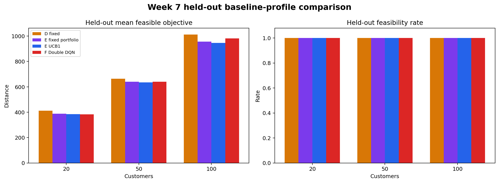

# Week 7: Complete Reinforcement-Learning Prototype

Week 7 is a self-directed research extension of the Week 6 Track B + Track C
workflow.  It turns the documented operator-selection MDP into a trainable
Double DQN while retaining the same EVRP-TW constructors, local-search
operators, validation rules, search budget, and held-out test instances used by
the non-learning references.

## Research question

> Can a small seed-separated Double DQN learn when to apply 2-opt, relocate, or
> swap and improve the quality/runtime trade-off over fixed search and UCB1 on
> held-out EVRP-TW instances?

## Architecture

```text
synthetic EVRP-TW instance
  -> nearest + composite construction sources
  -> independent feasibility validation
  -> feasibility-aware 2-opt warm start
  -> 12-value MDP state
  -> Double DQN selects {2-opt, relocate, swap}
  -> strict feasible-improvement transition
  -> best independently validated candidate
```

The learner is implemented in NumPy: a 12→32→3 MLP, experience replay,
epsilon-greedy exploration, Huber loss, Adam, a target network, and Double-DQN
targets.  The committed checkpoint is not a paper-scale attention model; it is
a complete, inspectable RL prototype for state-dependent operator selection.

## Files

- `rl_environment.py` — full MDP state, actions, transition, reward, episode,
  and terminal conditions over the real EVRP-TW operators.
- `dqn_agent.py` — dependency-light NumPy replay buffer, MLP, Adam optimizer,
  target network, Double-DQN update, and validated NPZ checkpoints.
- `train_week7_rl.py` — seed-separated training, held-out four-method
  evaluation, aggregation, comparisons, diagnostics, and output exporters.
- `reproducibility_check.py` — repeated model/result signature checks excluding
  timestamps and runtime.
- `visualize_week7.py` — six headless Matplotlib research figures.
- `tests/` — 14 environment, learning, integration, reproducibility, schema,
  and visualization tests.
- `results/` — locally generated model, tables, traces, logs, reports, and
  figures.

## Reproduce

```bash
python3 -m unittest discover -s src/experiments/week7/tests -p 'test_*.py' -v

python3 src/experiments/week7/train_week7_rl.py \
  --scales 20 50 100 \
  --profiles baseline tight_tw small_battery \
  --train-instances 8 --eval-instances 6 \
  --train-seed 20270013 --eval-seed 20280013 \
  --epochs 3 --max-steps 12 --patience 4 \
  --hidden-dim 32 --batch-size 32 --replay-capacity 5000 \
  --learning-rate 0.001 --gamma 0.95 --target-sync 100 \
  --agent-seed 20260813

python3 src/experiments/week7/visualize_week7.py
python3 src/experiments/week7/reproducibility_check.py
python3 src/results/generate_research_visualizations.py
```

## Actual local experiment

The committed run used Python 3.14.0 and NumPy 2.5.0 on macOS 15.6 arm64.

- **432 training episodes** from 144 feasible profile-scale-seed-source
  candidates repeated over 3 epochs.
- **4,388 training transitions** and **4,357 optimizer steps**.
- **216 held-out method-instance runs**: 54 unseen instances × four methods.
- Training/evaluation seed overlap: **0**.
- Independent route-validation failures: **0**.
- DQN held-out action trace: **1,012 transitions**.
- Training runtime: **92.54 s**; complete train/evaluate runtime: **206.59 s**.
- Checkpoint parameter SHA-256:
  `8b5b85cad33a3b91aed76441ebbb1dbee7a1ca73c49272f858d0be0a1f2d0de9`.

## Measured result

- Against Week 5 D, DQN has shorter mean feasible distance in all nine cells by
  **1.62%–8.20%**, with identical feasibility.
- Against Week 6 UCB1, DQN is shorter in **5/9** cells, tied in one, and worse
  in three.  The range is **-1.01% to +3.65%**.
- The clearest negative result is baseline n=100: DQN is **3.65% longer** than
  UCB1, although about **0.143 s faster** on mean runtime.
- All methods solve **53/54** held-out instances.  The shared small-battery
  n=20 seed `20300014` construction failure cannot be repaired by an
  operator-selection policy.
- DQN selects relocate 484 times (347 accepted), swap 329 times (146
  accepted), and 2-opt 199 times (63 accepted).  Relocate therefore has the
  highest held-out acceptance rate at **71.7%**.
- Mean training return rises from **0.0832** to **0.0973**, while mean warm-start
  improvement rises from **8.80%** to **10.17%** across the three epochs.
- The independent small reproducibility matrix reports **2/2 deterministic
  signature checks passed** and zero mismatches.

The result supports state-dependent learning as a useful extension, but not a
claim that DQN universally beats UCB1.  More training diversity or a graph
encoder is needed before attempting paper-level Deep-RL claims.



See [the full research note](../../../docs/week7_rl_extension.md),
[generated results](results/week7_results.md), and
[reproducibility report](results/reproducibility_report.md).
